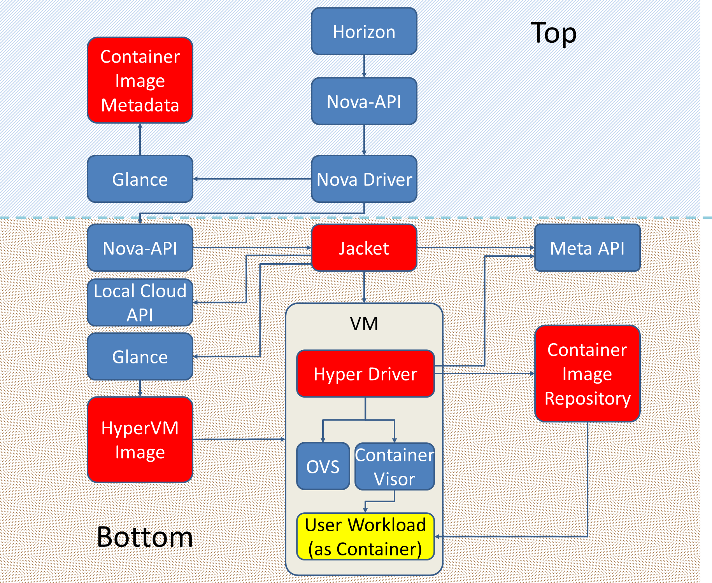
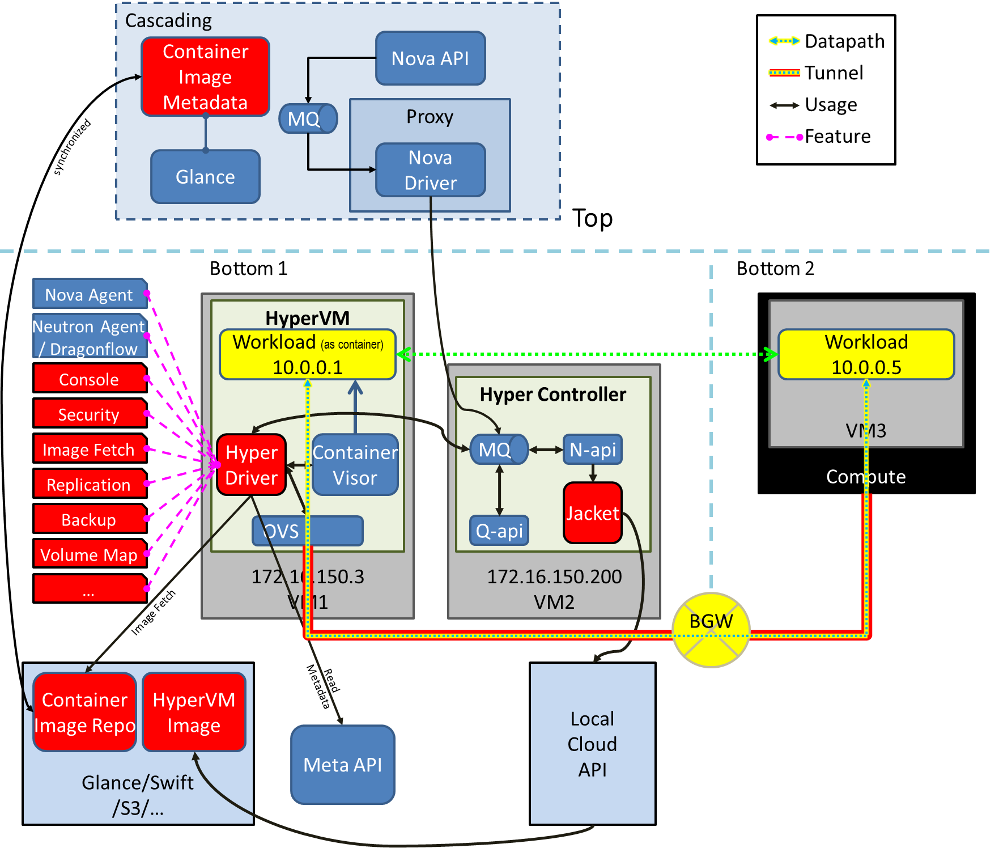
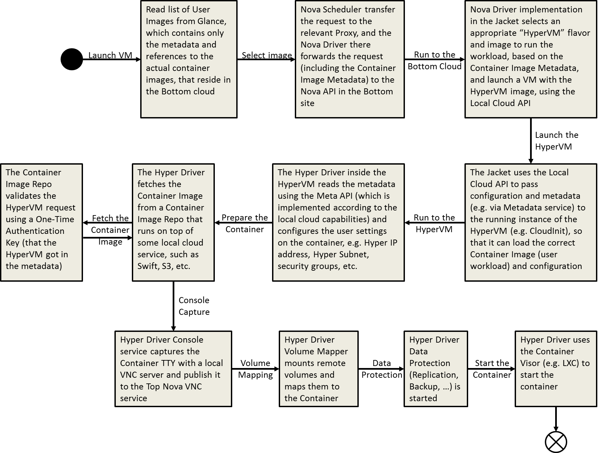

#HyperVM - Container-based Hyper Cloud

##Overview
We describe a solution for the Hyper Cloud using Container technology to isolate the User Workload / Application from the Hyper Cloud infrastructure, in a model where that infrastructure runs directly on the VM that hosts the workload.
In this model, we can support any type of underlying cloud infrastructure, with full functionality of stretched L2/L3.
In addition, we support transparent portable application image, since we are using a Container image technology (e.g. Docker Image, LXC image, etc.) for the application, instead of a virtual disk image (e.g. VMDK, QCOW, etc.).

###HyperVM
We introduce HyperVM concept - A VM image that contains the infrastructure that enables running the user workload in a container, and connecting this to the cross-cloud hyper subnet.

###Limitations
There are several limitations of using this technology:

 - At this time, only Linux OS supports container technology in mass market (with Microsoft Windows 2016 demonstrating this capability in Beta)
 - Users need to package their workload as a Container image (but can use this image across all underlying clouds, instead of maintaining multiple image variants)

###Technology
We compare 2 prominent Container Visor technologies: LXC and Docker.

|LXC|Docker|
|:-|:-|
|Operating System Containers|Application Containers|
|Customized init is spawned in container|Application is spawned directly|
|User space isolation multi process|Run a single service as a container|
|Mounting regular LVs via FSTAB (Device Mapper)|Data containers|
|TTY Console support|STDOUT / logs|
|Container runs in unprivileged user (inside the container, user can be ROOT, but outside the container it is NOBODY)|Container runs in ROOT user, privileges limited by Docker-0 (can give --privileged and gain partial ROOT capabilities to the container user on the host)|
|Comprehensive Linux Network tool accessible to container's SUDO (e.g. ifup/ifdown, ifconfig, dhclient, ...)|Network is set from outside, Container user cannot access the tools|

This comparison leads us to select LXC as the initial Container Visor, as it is more intuitive to running workloads that originated as a classic Virtual Machine.
In the future, any other technology can be supported as the Container Visor (as well as, of course, Docker).

###User Experience

####Scenario 1: User creates an application image
 - Launch a "Sandbox" application container (essentially, an empty container with the variant of Linux that the user wants)
 - Deploy the application into the "Sandbox" container (manually, or via automation tool, e.g. Jenkins)
 - Export the "Sandbox" as a portable HyperVM image
 - Push the new image to the Hyper repository

####Scenario 2: User launches a Hyper VM
Normal flow from user experience perspective

####Scenario 3: User migrates from a regular VM to a HyperVM
*TODO*

####Scenario 4: User migrates from a HyperVM to a regular VM
*TODO*

####Scenario 5: User migrates a HyperVM from Cloud-A to Cloud-B
*TODO*

####Scenario 6: User creates their own HyperVM image
*TODO*

##Architecture

###Container Image Metadata

In the Top site, we push "logical" images to Glance; these are basically just metadata that contains references to actual Container images that reside in the Bottom site, in the Container Image Repository (a separate mechanism, not necessarily Glance).
When the user selects an image to use in their VM, they are actually selecting a logical image from this catalog.

###Container Image Repository
The Container Image repository is a service that is accessible to the Hyper VM network (but not to the Hyper Subnets, where the Containers run).
It stores the container images prepared by the users, and provides an API for the Hyper VM to read the image at the first launch.
The images are keyed in alignment with the Top Glance logical image entries.
The Repository works with "single use tokens", so that a Hyper VM can only pull a single Container image at launch time (reduces the exploitability of this VM).

###Jacket
In the Bottom site, we deploy a VM that contains the "Jacket" - A set of agents based on OpenStack (Nova, Neutron, Ceilometer) with additional components, which is responsible to implement the API calls from the Top, using the APIs provided by the local cloud (e.g. EC2 in AWS, Nova in OpenStack, vCloud-API in vCloud, etc.)
In order to implement the HyperVM mechanism, we need to modify the "Launch VM" sequence, so that in case where the user selected a HyperVM-based image (as opposed to regular VM image), the following steps will take place:
1.	Call the Local Cloud APIs to create a VM using the most appropriate HyperVM image (the VM that will host the Container) and a VM flavor that can support it
2.	Pass the reference to the Logical image (the Container) to the HyperVM using the metadata service (or any other user-data injection mechanism supported by the local cloud API, e.g. CD ISO, Floppy drive, etc.), as well as other necessary configuration parameters (hyper IP and hyper Subnet, container image repository IP address, one-time token to download the container image, etc.)
3.	Start the HyperVM

###HyperVM
The HyperVM uses the Cloud Init mechanism to prepare the Container Visor (LXC/LXD, Docker, etc.), the networking pipeline (IP address translation, security group, firewall, encryption, etc.).  
It reads all the necessary metadata and configuration from the metadata server (e.g. using the 169.254.169.254 address, or the CD ISO, or floppy drive).  
Finally, it launches the container.

###Hyper VM Image
This is a pre-built image that contains all the necessary pipeline and services to run user workloads as containers.
It includes the Container Visor, OVS and Hyper Driver.
This image resides in the local cloud image repo (e.g. Glance), and has multiple flavors, to match VM capacity flavors, as well as different container visor technologies, embedded services and versions.

###Hyper Driver
This component is responsible for managing the Hyper VM as a Compute Node in the Cascaded level.  This includes capabilities to report into Nova and into Neutron.  Among other things, this also means it is responsible for maintaining the VTEP for the Workload (as Container).

##Example
Consider the following diagram:
 

As we can see, the User Workload (yellow) has an IP address 10.0.0.1.
It wants to connect with 10.0.0.5, which resides on a different site.
Using either Neutron agent or some other Neutron implementation (e.g. Dragonflow or DVR), we place the VTEP on the OVS output port.  We also make sure we translate the traffic coming in from the Container from the Hyper IP (10.0.0.1) to the Provider IP (172.16.150.3), by injecting an OpenFlow pipeline that implements PAT into the OVS.

 

##Dependencies
- HyperVM
 - The image needs to be available to the Local Cloud API, in order to be able to spin-up workload (e.g. placed in Glance or in whatever Image Repository is used)
 -	The image needs to include a Container Visor and appropriate OS (e.g. LXC and Ubuntu Linux, Windows Server 2016 and Windows Containers, any Linux and Docker, etc.)
 -	The image needs to read injected user data when it boots, in order to set up the "Hyper Driver" and launch the user workload in a container
 -	The image should provide a VNC service to gain Remote Console into the Workload Container (same as you get to a regular VM)
 -	The image should have access to a "Container Image Repo" service (on top of any relevant technology, e.g. Swift, S3, etc.)
-	Hyper Driver
 -	Includes a Nova Agent (n-agent) and a Neutron Agent (q-agent)
 -	Implements a "Compute Node" with a single VM (i.e. the Container)
 -	Connects to the local Meta API, either a REST API, CD ISO, Floppy drive, or any other mechanism.
 -	Connects to the "Container Image Repo" to copy the workload image, on the first boot.
-	Hyper Controller
 -	Includes a "Jacket" that abstracts the underlying cloud API
 -	Includes a message queue, Nova API and Neutron API, which receive commands from the Cascading service (Top site)
-	Container Image Repo
 -	Based on some underlying key-value store (e.g. Swift, S3, etc.)
 -	Provides API to read a user workload container image, using a "Single Use Token"
 -	Contains all the user workload containers, indexed by the same keys as the Top-site's Container Image Metadata
- Container Image Metadata
 - Based on Glance
 - Each user-defined workload (as Container) is inserted to the Container Image Metadata, without the actual image, only referencing the actual user workload container image that resides in the bottom site, in the Container Image Repo
- Jacket
 - Abstracts the local cloud APIs and services, providing a consistent API for the Hyper Controller's Nova API to use
 - Implement a Nova Driver to translate user actions to spin-up a "Logical Image" (from the "Container Image Metadata") into a spin-up of a HyperVM with the necessary injected metadata 

